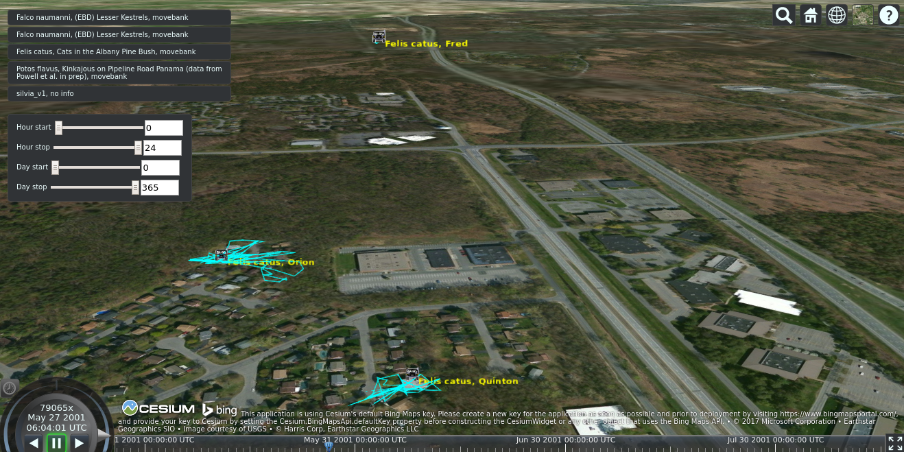

## zoak ##

Visualize animal tracking data in [Cesium](https://cesiumjs.org/). Easy import from movebank.



### Run ###

```bash
make
npm start
```

Then connect to http://127.0.0.1:8080/

### Add data ###

#### From movebank ####

1. Copy the downloaded csv file from [movebank](https://www.movebank.org/) to ```data/movebank/```
2. Run ```make -C data``` to generate [czml](https://github.com/AnalyticalGraphicsInc/czml-writer/wiki/CZML-Guide) from the csv and rebuild the data/index.js index.

Note that data from movebank can be downloaded from movebank [map](https://www.movebank.org/movebank/) or [API](https://github.com/movebank/movebank-api-doc/blob/master/movebank-api.md).

#### Other sources ####

1. Copy your [czml](https://github.com/AnalyticalGraphicsInc/czml-writer/wiki/CZML-Guide) file to ```data/```
2. Run ```make -C data/``` to rebuild the data/index.js index.

### Why zoak ###

While minimal, Zoak provides a mean to visualize animal tracking data on a much more flexible platform than typical custom applications used by different data providers. Zoak presents the tracking data in the [Cesium](https://cesiumjs.org/) interactive 3d environment, which enables data to be mixed with different imagery layers to understand better factors affecting animal movements. Cesium is contributed by a large community and includes a lot of option to create the environment where the visualisation could be usefull to the viewer, making a new unexpected pattern emerge from the tracks.

Features:
* Visualisation of GPS tracks in Cesium
* Import from [movebank](https://www.movebank.org/) facilitated (you should check license of data)
